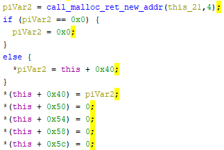

TODO: Edit Appendix

## Wrapper program

Since `rw.dll` is a library, it cannot be run directly. In order to debug 
`authentication_1` and examine the memory dump, I have created a wrapper
program. This program tries to call a library exported function as follow:

1. Load the library (`rw.dll`)
2. Locate the address of a given function (`authentication_1`)
3. Type cast the address to accept parameters (In `authentication_1`, there are 4)
4. Call the function

In debugger (x32dbg/OllyDbg), set a breakpoint in `main` and start stepping
over instructions. When the program loads the `rw.dll`, the entry function
is called in the library which does several initialisation and calls constructors.
One of the constructors (`0x10012430`) is a global class located in `0x10073ed8`. 
This class is used throughout the library and will be discussed later.



*A snippet of the constructor*

After that, the wrapper gets the address of `authentication_1`. This is achieved
by looking up the exported functions table from `rw.dll`. Then, type-cast the
address to a function that takes 4 arguments.

```c
typedef void (__cdecl *pFunIIII)(int, int, int, int);
// [...]
HINSTANCE hGetProcIDDLL = LoadLibrary(TEXT("rw.dll"))
FARPROC procAddr = GetProcAddress((HMODULE) hGetProcIDDLL, "authentication_1");
pFunIIII func = (pFunIIII)procAddr;
// [...]
func(param_1, param_2, param_3, param_4);
```

The code can be found in Appendix ... TODO: Edit Appendix

At a later stage of analysis, this wrapper program is not sufficient to examine
the function. `authentication_1` has a lot of function calls within functions.
It is not time efficient to analyse a particular function from the beginning,
especially when the function is deep (i.e. it is being called after several jumps).
Hence, I modified the wrapper function to not only calls exported function, but an
address. Given an address, the wrapper can directly calls it.

